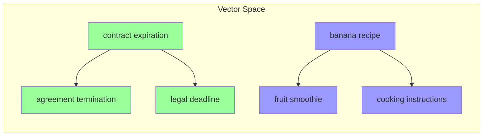
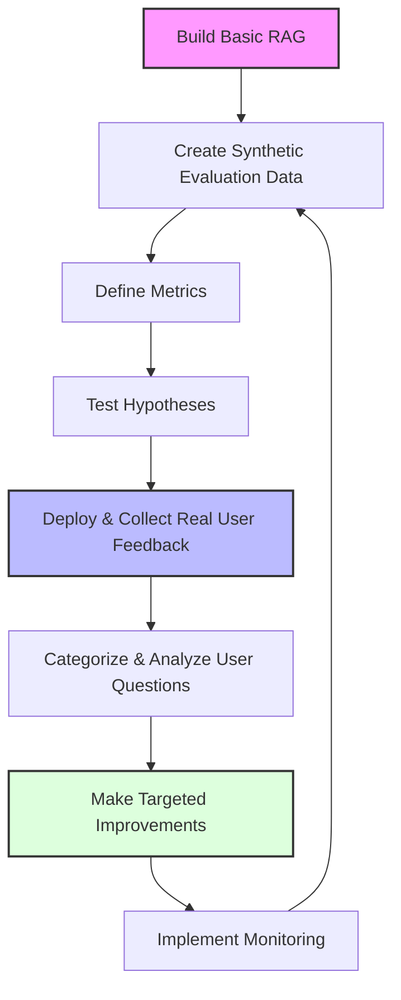

# Chapter 0: Introduction - The Product Mindset for RAG

## Chapter at a Glance

**Prerequisites**: Basic understanding of LLMs and familiarity with building software applications

**What You Will Learn**:

- Foundational RAG concepts (embeddings, vector databases, chunking)
- The product mindset vs implementation mindset
- The improvement flywheel framework
- Common failure patterns and how to avoid them

**Case Study Reference**: Legal tech company case study demonstrating systematic improvement from 63% to 87% accuracy

**Time to Complete**: 45-60 minutes

---

## Key Insight

**Successful RAG systems are not projects that ship once—they are products that improve continuously.** The difference between teams that succeed and those that fail is not the embedding model or vector database they choose. It is whether they treat RAG as a living product that learns from every user interaction, or as a static implementation that slowly decays in production.

---

## Learning Objectives

By the end of this chapter, you will be able to:

1. Explain the difference between an implementation mindset and a product mindset for RAG systems
2. Describe how embeddings, vector databases, and chunking work together in RAG
3. Distinguish between semantic and lexical search and know when to use each
4. Apply the improvement flywheel framework to your own RAG applications
5. Identify whether a problem is an inventory problem or a capability problem
6. Recognize common failure patterns that cause RAG systems to underperform

---

## Introduction

After a decade building AI systems, the same pattern repeats: teams ship a RAG system, celebrate the launch, then watch it slowly fail in production. User questions evolve. Data distributions shift. Edge cases multiply. Within weeks, the system that worked perfectly in demos struggles with real queries.

This book shows how to avoid that trap. The most successful RAG systems are not the ones with the fanciest embeddings or the biggest context windows—they are the ones that get better every week based on what users actually do with them. They treat deployment as the beginning of improvement, not the end of development.

!!! tip "For Product Managers"
    This chapter establishes the mental models you need to lead RAG initiatives effectively. Focus on the improvement flywheel, the inventory vs capability distinction, and how to measure success. You can skim the technical sections on embeddings and vector databases, but understanding the business implications of each concept will help you make better decisions.

!!! tip "For Engineers"
    This chapter provides foundational concepts you will use throughout the book. Pay special attention to the technical sections on embeddings, vector databases, and chunking. These concepts appear in every subsequent chapter, so building strong intuition here will pay dividends later.

---

## Core Content

### Foundational Concepts

Before diving into improvement strategies, you need to understand the building blocks of RAG systems. These concepts appear throughout this book, so we introduce them here with both business context and technical depth.

#### Embeddings and Vector Representations

Embeddings are the foundation of modern RAG systems. They transform text into numerical representations that capture meaning.

!!! tip "For Product Managers"
    **What embeddings mean for your business**: Embeddings determine how well your system understands user intent. Poor embeddings mean users cannot find what they need, even when the answer exists in your knowledge base. When evaluating RAG vendors or approaches, ask: "How well do these embeddings capture the vocabulary and concepts specific to our domain?"

    **Key decision point**: Off-the-shelf embeddings work well for general content. Domain-specific content (legal, medical, technical) often benefits from fine-tuned embeddings. The ROI of fine-tuning depends on how specialized your vocabulary is.

!!! tip "For Engineers"
    **How embeddings work**: An embedding model converts text into a dense vector (typically 384-1536 dimensions). Similar texts produce similar vectors, measured by cosine similarity.

    ```python
    from sentence_transformers import SentenceTransformer

    model = SentenceTransformer('all-MiniLM-L6-v2')

    # These will have similar embeddings
    text1 = "The contract expires on December 31st"
    text2 = "The agreement terminates at year end"

    embedding1 = model.encode(text1)
    embedding2 = model.encode(text2)

    # Cosine similarity will be high (close to 1.0)
    ```

    **Vector space intuition**: Think of embeddings as coordinates in a high-dimensional space. Words and phrases with similar meanings cluster together. "Contract" and "agreement" are close. "Contract" and "banana" are far apart.

    **Cosine similarity**: Measures the angle between two vectors, ranging from -1 (opposite) to 1 (identical). For normalized embeddings, this is equivalent to the dot product. Most RAG systems consider similarity above 0.7-0.8 as "relevant."



#### Vector Databases

Vector databases store embeddings and enable fast similarity search at scale.

!!! tip "For Product Managers"
    **Why vector databases matter**: Traditional databases find exact matches. Vector databases find similar matches. This is what enables semantic search—finding documents that mean the same thing as the query, even if they use different words.

    **Cost considerations**: Vector databases charge based on storage (number of vectors) and queries per second. For most applications, costs are modest ($50-500/month). Costs increase significantly at scale (millions of documents) or with high query volume.

    **Key vendors**: Pinecone (managed, easy to start), Weaviate (open source, flexible), pgvector (PostgreSQL extension, good for existing Postgres users), LanceDB (open source, hybrid search support).

!!! tip "For Engineers"
    **How vector databases work**: They use Approximate Nearest Neighbor (ANN) algorithms to find similar vectors without comparing against every stored vector. Common algorithms include HNSW (Hierarchical Navigable Small World) and IVF (Inverted File Index).

    **Tradeoffs**:

    | Factor | Exact Search | ANN Search |
    |--------|--------------|------------|
    | Speed | O(n) - slow at scale | O(log n) - fast |
    | Accuracy | 100% | 95-99% typical |
    | Memory | Low | Higher (index structures) |

    **When to use what**:

    - Small datasets (<10K documents): Exact search is fine
    - Medium datasets (10K-1M): ANN with high recall settings
    - Large datasets (>1M): ANN with tuned parameters

    ```python
    # Example: LanceDB vector database
    import lancedb
    from lancedb.pydantic import LanceModel, Vector

    class Document(LanceModel):
        id: str
        text: str
        vector: Vector(384)  # Matching embedding dimension

    db = lancedb.connect(":memory:")
    table = db.create_table("documents", schema=Document)
    ```

#### Semantic vs Lexical Search

Understanding when to use semantic search versus lexical search is critical for RAG performance.

!!! tip "For Product Managers"
    **When semantic search wins**: Users describe what they want in their own words. "How do I cancel my subscription?" should match documentation titled "Account Termination Process."

    **When lexical search wins**: Users search for specific terms, product codes, or exact phrases. "Error code E-4521" should match documents containing that exact string.

    **Business implication**: Most production systems need both. Hybrid search combines semantic and lexical approaches. The investment in hybrid search typically pays off when you have both natural language queries and exact-match requirements.

!!! tip "For Engineers"
    **Lexical search (BM25)**: Ranks documents by term frequency and inverse document frequency. Works well for exact matches, rare terms, and when users know the vocabulary.

    ```python
    # BM25 excels at exact matches
    query = "42 U.S.C. § 1983"  # Legal citation
    # Lexical search finds exact match
    # Semantic search might miss it (citation is not "meaningful")
    ```

    **Semantic search (embeddings)**: Ranks by meaning similarity. Works well for natural language queries, synonyms, and when users do not know exact terminology.

    ```python
    # Semantic search excels at meaning
    query = "employee fired unfairly"
    # Matches documents about "wrongful termination"
    # Lexical search would miss this (different words)
    ```

    **Hybrid approach**: Retrieve with both methods, then combine results using Reciprocal Rank Fusion (RRF) or learned weights.

    ```python
    def hybrid_search(query, alpha=0.5):
        semantic_results = semantic_search(query)
        lexical_results = lexical_search(query)
        return reciprocal_rank_fusion(semantic_results, lexical_results, alpha)
    ```

#### Chunking Strategies

Chunking determines how documents are split for retrieval. Poor chunking is one of the most common causes of RAG failures.

!!! tip "For Product Managers"
    **Why chunking matters**: Chunks that are too small lose context. Chunks that are too large dilute relevance. The right chunking strategy depends on your content type and query patterns.

    **Size considerations**:

    - Small chunks (200-500 tokens): Good for precise answers, bad for context
    - Medium chunks (500-1000 tokens): Balanced approach for most use cases
    - Large chunks (1000-2000 tokens): Good for complex topics, may include irrelevant content

    **Key question to ask**: "When users ask questions, how much context do they need to get a useful answer?"

!!! tip "For Engineers"
    **Common chunking strategies**:

    | Strategy | Best For | Tradeoffs |
    |----------|----------|-----------|
    | Fixed-size | Simple documents, consistent format | May split mid-sentence |
    | Sentence-based | Conversational content | Chunks vary in size |
    | Semantic | Complex documents | Computationally expensive |
    | Page-level | PDFs, structured documents | Large chunks, may miss details |
    | Hierarchical | Long documents, books | Complex to implement |

    **Implementation example**:

    ```python
    def recursive_character_split(
        text: str,
        chunk_size: int = 1000,
        chunk_overlap: int = 200,
        separators: list[str] = ["\n\n", "\n", ". ", " ", ""]
    ) -> list[str]:
        """
        Split text recursively by separators, respecting chunk size and overlap.
        
        Args:
            text: Text to split
            chunk_size: Maximum size of each chunk
            chunk_overlap: Number of characters to overlap between chunks
            separators: List of separators to try, in order of preference
        
        Returns:
            List of text chunks
        """
        if len(text) <= chunk_size:
            return [text]
        
        chunks = []
        start = 0
        
        while start < len(text):
            end = start + chunk_size
            
            if end >= len(text):
                chunks.append(text[start:])
                break
            
            # Try to find a good split point using separators
            split_pos = end
            for separator in separators:
                if separator:
                    # Look backwards from end for separator
                    pos = text.rfind(separator, start, end)
                    if pos != -1:
                        split_pos = pos + len(separator)
                        break
            
            chunk = text[start:split_pos]
            chunks.append(chunk)
            
            # Move start forward with overlap
            start = split_pos - chunk_overlap
            if start < 0:
                start = 0
        
        return chunks

    # Usage: Split document with semantic boundaries and overlap
    chunks = recursive_character_split(
        document,
        chunk_size=1000,
        chunk_overlap=200,
        separators=["\n\n", "\n", ". ", " ", ""]
    )
    ```

    **Critical insight from production**: Many tutorials recommend tiny chunks (200 characters) based on outdated advice for models with limited context windows. Modern models handle larger chunks well. In one e-commerce implementation, small chunks meant no single chunk contained complete product information, causing 13% hallucination rate.

#### The Alignment Problem

The alignment problem is one of the most overlooked causes of RAG failures.

!!! tip "For Product Managers"
    **What alignment means**: Your embeddings must align with how users search. If you embed product descriptions but users search by purchase patterns, retrieval will fail even with perfect embeddings.

    **Business impact**: Misalignment causes the frustrating situation where "the answer is in there somewhere" but the system cannot find it. Users lose trust quickly.

    **How to detect**: Compare what you embed (document content) with what users search for (query patterns). If they use different vocabulary or concepts, you have an alignment problem.

!!! tip "For Engineers"
    **Technical explanation**: Embedding models are trained on specific tasks. Most are trained for semantic similarity between similar texts. But RAG requires matching questions to answers—a different task.

    **Example of misalignment**:

    ```python
    # Document: "The Model X features autopilot and 300-mile range"
    # Query: "Which Tesla should I buy for long road trips?"

    # The query is about use case (road trips)
    # The document is about features (range)
    # Standard embeddings may not connect these well
    ```

    **Solutions**:

    1. Query expansion: Transform queries to look more like documents
    2. Hypothetical document embeddings (HyDE): Generate a hypothetical answer, embed that
    3. Fine-tuning: Train embeddings on your specific query-document pairs
    4. Contextual retrieval: Add context to chunks at indexing time

#### Inventory vs Capability Problem

Before optimizing your RAG system, determine whether you have an inventory problem or a capability problem.

!!! tip "For Product Managers"
    **Strategic distinction**: These problems require completely different solutions. Investing in better retrieval when you lack content wastes resources. Adding content when retrieval is broken wastes resources.

    **Inventory problem**: The answer does not exist in your knowledge base

    - Missing documents entirely
    - Outdated information
    - Gaps in content coverage
    - **Solution**: Add or update content

    **Capability problem**: The answer exists but the system cannot find it

    - Poor retrieval failing to match query to document
    - Wrong search strategy for the query type
    - Inability to understand query intent
    - **Solution**: Improve retrieval, understanding, or routing

!!! tip "For Engineers"
    **How to diagnose**:

    ```python
    def diagnose_failure(query, expected_document):
        # Step 1: Does the document exist?
        if not document_exists(expected_document):
            return "INVENTORY_PROBLEM"

        # Step 2: Can a human find it?
        if human_can_find(query, expected_document):
            return "CAPABILITY_PROBLEM"

        # Step 3: Is the content sufficient?
        if not content_answers_query(expected_document, query):
            return "INVENTORY_PROBLEM"  # Content exists but does not answer

        return "CAPABILITY_PROBLEM"
    ```

    **Real example**: A team spent months improving their embedding model when the actual problem was that 21% of their documents were silently dropped during ingestion due to encoding issues. Always verify your inventory before optimizing capabilities.

---

### The Product Mindset

When organizations implement RAG systems, they often approach it as a purely technical challenge. They focus on selecting the right embedding model, vector database, and LLM, then consider the project "complete" once these components are integrated and deployed.

This approach inevitably leads to disappointment.

!!! tip "For Product Managers"
    **Why product thinking matters**: RAG systems serve users, not benchmarks. The teams that succeed are the ones that measure user outcomes, not just technical metrics. Your role is to ensure the team stays focused on user value, not technical elegance.

    **ROI of systematic improvement**: Teams with a systematic approach ship improvements weekly. Teams without one spend months debating what might work. The compound effect is dramatic—after six months, systematic teams are 10x better than ad-hoc teams.

!!! tip "For Engineers"
    **How to apply product thinking**: Every technical decision should connect to user outcomes. When evaluating a new embedding model, do not just look at benchmark scores—test it on your actual queries and measure user-facing metrics.

    **The mental shift**:

    | Old Question | New Question |
    |--------------|--------------|
    | Which embedding model has the best benchmark? | Which embedding helps users find answers fastest? |
    | What is the optimal chunk size? | How do we know if chunking helps or hurts users? |
    | How do we eliminate hallucinations? | How do we build trust even when imperfect? |
    | Should we use GPT-4 or Claude? | Which model capabilities matter for our use case? |

Here is how to identify which mindset a team has:

**Implementation Mindset:**

- "We need to implement RAG"
- Obsessing over embedding dimensions and context windows
- Success = it works in the demo
- Big upfront architecture decisions
- Focus on picking the "best" model

**Product Mindset:**

- "We need to help users find answers faster"
- Tracking answer relevance and task completion
- Success = users keep coming back
- Architecture that can evolve
- Focus on learning from user behavior

---

### The Improvement Flywheel

The improvement flywheel is the framework that transforms RAG from a static implementation into a continuously improving product.



!!! tip "For Product Managers"
    **Business value of the flywheel**: Each rotation makes the next one faster. More data leads to better insights, which lead to smarter improvements, which generate more engaged users who provide better data. After 3-4 rotations, teams report 50% reduction in time-to-improvement.

    **Key metrics to track at each stage**:

    | Stage | Leading Metric | Lagging Metric |
    |-------|----------------|----------------|
    | Cold Start | Evaluation coverage | N/A |
    | Deployment | Feedback rate | User satisfaction |
    | Growth | Improvement velocity | Retention |
    | Optimization | Cost per query | Revenue impact |

!!! tip "For Engineers"
    **Technical implementation of the flywheel**:

    **Stage 1 - Synthetic Data**: Generate questions from your content to bootstrap evaluation.

    ```python
    def generate_synthetic_question(chunk: str) -> str:
        prompt = f"""Generate a question that would be answered by this text:

        {chunk}

        Question:"""
        return llm.generate(prompt)
    ```

    **Stage 2 - Metrics**: Implement precision, recall, and MRR tracking.

    **Stage 3 - Feedback**: Instrument your application for data collection.

    **Stage 4 - Analysis**: Use clustering to identify query patterns.

    **Stage 5 - Improvement**: Build specialized retrievers for high-impact segments.

    **Stage 6 - Monitoring**: Track performance continuously, alert on regressions.

The flywheel solves real problems at each stage:

| Phase | Business Challenge | Technical Challenge | Flywheel Solution |
|-------|-------------------|--------------------|--------------------|
| **Cold Start** | No data to guide design decisions | No examples to train or evaluate against | Generate synthetic questions from content, establish baseline metrics |
| **Initial Deployment** | Understanding what users actually need | Learning what causes poor performance | Instrument application for data collection, implement feedback mechanisms |
| **Growth** | Prioritizing improvements with limited resources | Addressing diverse query types effectively | Use topic modeling to segment questions, identify highest-impact opportunities |
| **Optimization** | Maintaining quality as usage scales | Combining multiple specialized components | Create unified routing architecture, implement monitoring and alerts |

---

### Common Failure Patterns

Understanding why RAG systems fail helps you avoid the same mistakes.

!!! warning "PM Pitfall"
    **Treating RAG as a project, not a product**: The most common strategic mistake is declaring victory after launch. RAG systems decay without continuous improvement. Plan for ongoing investment from the start.

    **Optimizing the wrong metric**: Teams often optimize for retrieval metrics (precision, recall) while ignoring user outcomes (task completion, satisfaction). A system with 95% precision but 10% task completion is failing.

    **Ignoring the cold start**: Without evaluation data, you cannot measure improvement. Teams that skip synthetic data generation spend months guessing what might work.

!!! warning "Engineering Pitfall"
    **Silent data loss**: In one medical chatbot project, 21% of documents were silently dropped due to encoding issues. The team spent months debugging retrieval when the problem was missing data. Always monitor document counts at each pipeline stage.

    **Chunking too small**: Many implementations use tiny chunks (200 characters) because they follow outdated tutorials. This dilutes context and causes hallucinations. Test chunk sizes on your actual queries.

    **Naive embedding usage**: Most embeddings are trained for semantic similarity between similar texts, not for matching questions to answers. Consider query expansion, HyDE, or fine-tuning.

    **Index staleness**: In a financial news system, the index had not been refreshed for two weeks, causing outdated earnings reports to be returned. Monitor index freshness for time-sensitive applications.

    **Accepting vague queries**: Queries like "health tips" force your system to retrieve broadly. Implement query classification to detect and handle low-information queries.

---

## How to Use This Book

This book is designed for two audiences: Product Managers and Engineers. Each chapter includes content for both, clearly marked with admonitions.

### Reading Paths

**For Product Managers**:

1. Read the "Key Insight" and "Learning Objectives" for each chapter
2. Focus on sections marked "For Product Managers"
3. Skim technical sections for context, but do not worry about implementation details
4. Pay close attention to "Common Pitfalls" and "Action Items"

**For Engineers**:

1. Read chapters in order—concepts build on each other
2. Focus on sections marked "For Engineers"
3. Work through code examples in your own environment
4. Use the appendices for mathematical deep dives

**For Full Understanding**:

1. Read everything in order
2. Work through code examples
3. Complete reflection questions
4. Apply concepts to your own RAG system

### Admonition Types

Throughout this book, you will see these callout boxes:

!!! tip "For Product Managers"
    Strategic insights, business implications, and decision frameworks for product leaders.

!!! tip "For Engineers"
    Technical details, implementation guidance, and code examples for developers.

!!! warning "PM Pitfall"
    Strategic mistakes that product teams commonly make.

!!! warning "Engineering Pitfall"
    Technical mistakes that engineering teams commonly make.

!!! info
    General information relevant to all readers.

!!! example
    Concrete examples illustrating concepts.

!!! success
    Success stories and positive outcomes.

### Navigation Guide

Each chapter follows the same structure:

1. **Chapter at a Glance**: Prerequisites, outcomes, time estimate
2. **Key Insight**: One-paragraph summary
3. **Learning Objectives**: What you will be able to do
4. **Introduction**: Context and motivation
5. **Core Content**: Main material with PM and Engineer sections
6. **Case Study Deep Dive**: Real-world application
7. **Implementation Guide**: Step-by-step instructions
8. **Common Pitfalls**: Mistakes to avoid
9. **Related Content**: Links to talks, transcripts, office hours
10. **Action Items**: Next steps for PM and Engineering teams
11. **Reflection Questions**: Self-assessment
12. **Summary**: Key takeaways
13. **Further Reading**: Academic papers and tools
14. **Related Chapters**: Links to related content
15. **Navigation**: Links to previous and next chapters

---

## Case Study Deep Dive

### Legal Tech Company: From 63% to 87% Accuracy

A legal tech company building case law search provides a concrete example of the improvement flywheel in action.

!!! tip "For Product Managers"
    **Business outcomes**:

    - Research time reduced by 40%
    - Lawyers began using the system daily (vs. occasional use before)
    - Clear roadmap for continued improvement
    - Engineering time allocated based on data, not opinions

    **Key decisions that drove success**:

    1. Invested in synthetic data generation before launch
    2. Implemented feedback collection from day one
    3. Used query clustering to identify high-impact segments
    4. Built specialized retrievers for distinct query types

!!! tip "For Engineers"
    **Technical implementation timeline**:

    **Month 1 - Baseline**: Basic RAG with standard embeddings. Generated 200 test queries from case law. Baseline accuracy: 63%.

    **Month 2 - First Iteration**: Testing revealed legal citations like "42 U.S.C. § 1983" were being split across chunks. Fixed chunking to respect citation patterns. Accuracy: 72%.

    **Month 3 - Deployment**: Shipped with thumbs up/down feedback. Tracked which answers lawyers copied into briefs.

    **Months 4-5 - Pattern Discovery**: After 5,000 queries, three distinct patterns emerged:

    | Query Type | Volume | Accuracy | Status |
    |------------|--------|----------|--------|
    | Case citations | 40% | 91% | Working well |
    | Legal definitions | 35% | 78% | Acceptable |
    | Procedural questions | 25% | 34% | Failing |

    **Month 6 - Specialized Solutions**: Built dedicated retrieval for each type:

    - Case citations: Exact matching on citation format
    - Definitions: Specialized glossary index
    - Procedural questions: Separate index from court rules

    Overall accuracy: 87%.

    **Ongoing**: Monitoring revealed procedural questions growing 3x faster than other types, directing engineering focus for the next quarter.

---

## Implementation Guide

### Quick Start for PMs

**Week 1: Establish Baseline**

1. Define what "success" means for your RAG system (task completion? time saved?)
2. Identify 3-5 key user journeys to measure
3. Work with engineering to generate synthetic evaluation data
4. Establish baseline metrics

**Week 2: Instrument for Learning**

1. Add feedback collection (thumbs up/down minimum)
2. Set up query logging
3. Create a dashboard for key metrics
4. Schedule weekly metric reviews

**Week 3: Begin Improvement Cycle**

1. Review first week of feedback data
2. Identify top 3 failure patterns
3. Prioritize based on user impact and engineering effort
4. Start first improvement sprint

**Ongoing: Maintain the Flywheel**

- Weekly: Review metrics, identify issues
- Monthly: Analyze query clusters, update priorities
- Quarterly: Assess overall progress, adjust strategy

### Detailed Implementation for Engineers

**Step 1: Generate Synthetic Evaluation Data**

```python
import asyncio
from typing import List, Tuple

async def generate_eval_dataset(
    chunks: List[str],
    llm_client,
    num_questions_per_chunk: int = 2
) -> List[Tuple[str, str, str]]:
    """Generate (question, chunk_id, expected_answer) tuples."""

    async def generate_for_chunk(chunk: str, chunk_id: str):
        prompt = f"""Based on this text, generate {num_questions_per_chunk} questions
        that could be answered using this information.

        Text: {chunk}

        Format each question on a new line."""

        response = await llm_client.generate(prompt)
        questions = response.strip().split('\n')
        return [(q, chunk_id, chunk) for q in questions if q.strip()]

    tasks = [
        generate_for_chunk(chunk, f"chunk_{i}")
        for i, chunk in enumerate(chunks)
    ]
    results = await asyncio.gather(*tasks)
    return [item for sublist in results for item in sublist]
```

**Step 2: Implement Evaluation Metrics**

```python
from typing import List, Dict
import numpy as np

def calculate_retrieval_metrics(
    queries: List[str],
    expected_chunks: List[str],
    retrieved_chunks: List[List[str]],
    k: int = 5
) -> Dict[str, float]:
    """Calculate precision, recall, and MRR at k."""

    precisions = []
    recalls = []
    reciprocal_ranks = []

    for expected, retrieved in zip(expected_chunks, retrieved_chunks):
        retrieved_k = retrieved[:k]

        # Precision: relevant retrieved / total retrieved
        relevant_retrieved = 1 if expected in retrieved_k else 0
        precisions.append(relevant_retrieved / len(retrieved_k))

        # Recall: relevant retrieved / total relevant (1 in this case)
        recalls.append(relevant_retrieved)

        # MRR: 1 / rank of first relevant result
        if expected in retrieved_k:
            rank = retrieved_k.index(expected) + 1
            reciprocal_ranks.append(1 / rank)
        else:
            reciprocal_ranks.append(0)

    return {
        "precision_at_k": np.mean(precisions),
        "recall_at_k": np.mean(recalls),
        "mrr": np.mean(reciprocal_ranks)
    }
```

**Step 3: Set Up Feedback Collection**

```python
from datetime import datetime
from pydantic import BaseModel, Field
from enum import Enum

class FeedbackType(str, Enum):
    THUMBS_UP = "thumbs_up"
    THUMBS_DOWN = "thumbs_down"

class QueryFeedback(BaseModel):
    query_id: str
    query_text: str
    response_text: str
    retrieved_chunks: List[str]
    feedback_type: FeedbackType
    feedback_text: str | None = None
    timestamp: datetime = Field(default_factory=datetime.now)
    user_id: str | None = None

async def log_feedback(feedback: QueryFeedback, db_client):
    """Log feedback for analysis."""
    await db_client.insert("feedback", feedback.model_dump())
```

**Step 4: Implement Query Clustering**

```python
from sklearn.cluster import KMeans
from sentence_transformers import SentenceTransformer

def cluster_queries(
    queries: List[str],
    n_clusters: int = 10
) -> Dict[int, List[str]]:
    """Cluster queries to identify patterns."""

    model = SentenceTransformer('all-MiniLM-L6-v2')
    embeddings = model.encode(queries)

    kmeans = KMeans(n_clusters=n_clusters, random_state=42)
    labels = kmeans.fit_predict(embeddings)

    clusters = {}
    for query, label in zip(queries, labels):
        if label not in clusters:
            clusters[label] = []
        clusters[label].append(query)

    return clusters
```

---

## Common Pitfalls

### PM Pitfalls

!!! warning "PM Pitfall: Declaring Victory Too Early"
    **The mistake**: Celebrating launch and moving the team to other projects.

    **Why it happens**: RAG demos well. Stakeholders see impressive results and assume the work is done.

    **The consequence**: System performance degrades as user patterns evolve and content becomes stale.

    **How to avoid**: Plan for ongoing investment from the start. Budget engineering time for continuous improvement, not just initial development.

!!! warning "PM Pitfall: Optimizing Vanity Metrics"
    **The mistake**: Focusing on retrieval metrics (precision, recall) while ignoring user outcomes.

    **Why it happens**: Retrieval metrics are easy to measure. User outcomes require more instrumentation.

    **The consequence**: A system that looks good on paper but fails users in practice.

    **How to avoid**: Always connect technical metrics to user outcomes. If precision improves but task completion does not, something is wrong.

!!! warning "PM Pitfall: Skipping the Cold Start"
    **The mistake**: Deploying without evaluation data, planning to "learn from users."

    **Why it happens**: Generating synthetic data feels like extra work before launch.

    **The consequence**: No baseline to measure against. Months of guessing what might work.

    **How to avoid**: Invest in synthetic data generation before launch. Even 100 synthetic queries provide valuable signal.

### Engineering Pitfalls

!!! warning "Engineering Pitfall: Silent Data Loss"
    **The mistake**: Not monitoring document counts through the ingestion pipeline.

    **Why it happens**: Errors are caught and logged, but not aggregated or alerted on.

    **The consequence**: Significant portions of your knowledge base are missing without anyone knowing.

    **How to avoid**: Track document counts at each pipeline stage. Alert when counts drop unexpectedly. In one case, 21% of documents were silently dropped due to encoding issues.

!!! warning "Engineering Pitfall: Following Outdated Tutorials"
    **The mistake**: Using tiny chunks (200 characters) because a tutorial said so.

    **Why it happens**: Many tutorials were written for models with limited context windows.

    **The consequence**: Chunks too small to contain meaningful information, leading to hallucinations.

    **How to avoid**: Test chunk sizes on your actual queries. Modern models handle larger chunks well.

!!! warning "Engineering Pitfall: Ignoring the Alignment Problem"
    **The mistake**: Assuming standard embeddings will work for your domain.

    **Why it happens**: Embeddings work well on benchmarks, so they should work everywhere.

    **The consequence**: Users cannot find answers even when they exist, because queries and documents are embedded differently.

    **How to avoid**: Compare query patterns to document content. If they use different vocabulary or concepts, consider query expansion, HyDE, or fine-tuning.

---

## Related Content

### Key Insights from the Course

- "The goal is not to build AGI—the goal is to create economically valuable work."
- "Success is defined by doing the most obvious thing over and over again. Your only job is to apply consistent effort."
- "Think about building a recommendation system wrapped around a language model, not just retrieval-augmented generation."

### Talk: RAG Antipatterns (Skylar Payne)

Full talk available at `docs/talks/rag-antipatterns-skylar-payne.md`. Key insights:

- **Data quality is foundational**: "Look at your data at every step of the process. Start from understanding what your users want, work backwards."
- **Silent failures are dangerous**: In one implementation, 21% of documents were silently dropped due to encoding issues.
- **Evaluate before adding complexity**: "About 90% of the time, teams implement complex retrieval paths without evaluating if they actually improve performance."
- **The teams that win iterate fastest**: "The teams who can make that loop go as fast as possible are the ones who win."

### Office Hours

Relevant office hours sessions:

- **Cohort 2 Week 1**: Discussion of product mindset, cold start problems
- **Cohort 3 Week 1**: Deep dive on evaluation-first development

---

## Action Items

### For Product Teams

1. **This week**: Define success metrics for your RAG system that connect to user outcomes
2. **This month**: Implement feedback collection (minimum: thumbs up/down)
3. **This quarter**: Establish the improvement flywheel with weekly metric reviews
4. **Ongoing**: Maintain a prioritized backlog based on query cluster analysis

### For Engineering Teams

1. **This week**: Generate synthetic evaluation data from your content (minimum 100 queries)
2. **This month**: Implement retrieval metrics (precision, recall, MRR) and establish baselines
3. **This quarter**: Set up query logging and clustering to identify patterns
4. **Ongoing**: Monitor document counts, index freshness, and retrieval performance

---

## Reflection Questions

1. Is your current RAG system treated as a completed project or an evolving product? What would need to change to shift toward a product mindset?

2. Do you have mechanisms in place to learn from user interactions? If not, what is the simplest feedback mechanism you could implement this week?

3. How do you currently measure success? Are your metrics leading indicators (actionable) or lagging indicators (outcomes)?

4. Think of a recent RAG failure. Was it an inventory problem (missing content) or a capability problem (content exists but was not found)? How would you diagnose this systematically?

5. If you had to improve your RAG system by 20% in the next month, where would you focus? What data would you need to make that decision confidently?

---

## Summary

### Key Takeaways for Product Managers

- RAG systems are products, not projects. Plan for continuous improvement from day one.
- The improvement flywheel (synthetic data → metrics → feedback → analysis → improvement) is your roadmap.
- Distinguish between inventory problems (missing content) and capability problems (cannot find existing content)—they require different solutions.
- Connect technical metrics to user outcomes. Precision and recall matter only if they improve task completion.
- The teams that iterate fastest win. Build systems that enable rapid experimentation.

### Key Takeaways for Engineers

- Foundational concepts (embeddings, vector databases, chunking) appear throughout RAG systems. Build strong intuition here.
- The alignment problem (mismatch between how you embed and how users search) is a common cause of failures.
- Silent data loss is more common than you think. Monitor document counts at every pipeline stage.
- Do not follow outdated tutorials blindly. Test chunk sizes, embedding models, and retrieval strategies on your actual queries.
- Implement evaluation before adding complexity. Most "improvements" make things worse when properly measured.

---

## Further Reading

### Academic Papers

- "Retrieval-Augmented Generation for Knowledge-Intensive NLP Tasks" (Lewis et al., 2020) - The original RAG paper
- "Dense Passage Retrieval for Open-Domain Question Answering" (Karpukhin et al., 2020) - Foundation for modern retrieval
- "BEIR: A Heterogeneous Benchmark for Zero-shot Evaluation of Information Retrieval Models" (Thakur et al., 2021) - Standard evaluation benchmark

### Tools and Libraries

- **Embedding Models**: sentence-transformers, OpenAI embeddings, Cohere embeddings
- **Vector Databases**: Pinecone, Weaviate, pgvector, Chroma, LanceDB
- **Evaluation**: RAGAS, LangSmith, Braintrust
- **Frameworks**: LlamaIndex, Haystack

### Related Chapters

- Chapter 1: Evaluation-First Development - Deep dive on metrics and synthetic data
- Chapter 2: Training Data and Fine-Tuning - How to improve embeddings for your domain
- Chapter 3: Feedback Systems and UX - Implementing effective feedback collection

---

## Navigation

- **Next**: [Chapter 1: Evaluation-First Development](chapter1.md) - Learn to measure before you optimize
- **Reference**: [Glossary](glossary.md) | [Quick Reference](quick-reference.md)
- **Book Index**: [Book Overview](index.md)
