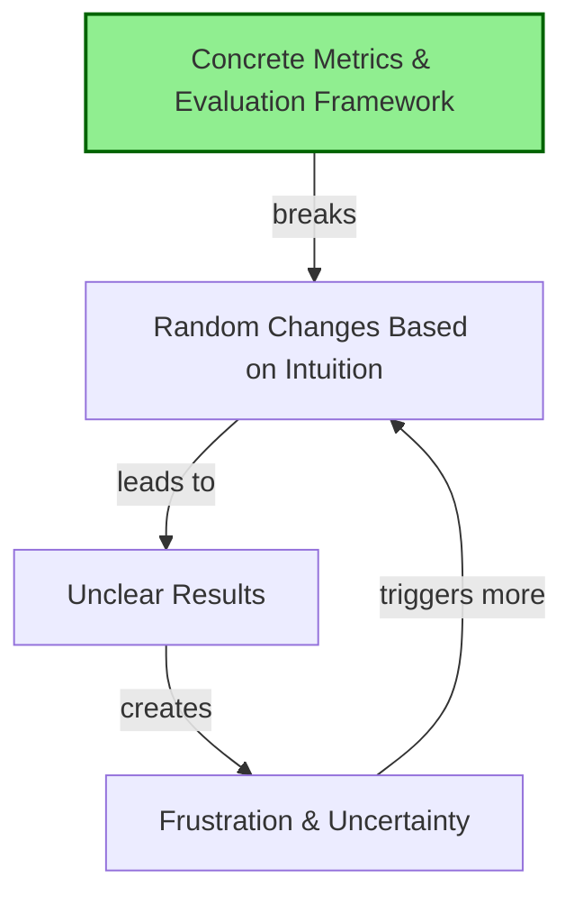
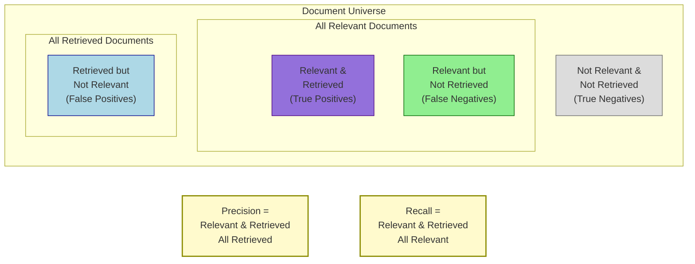
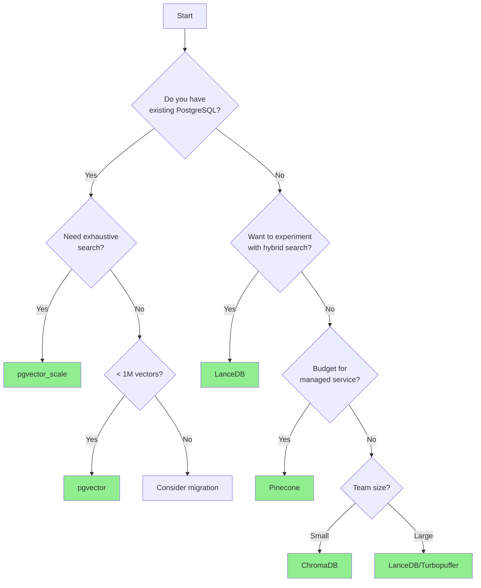
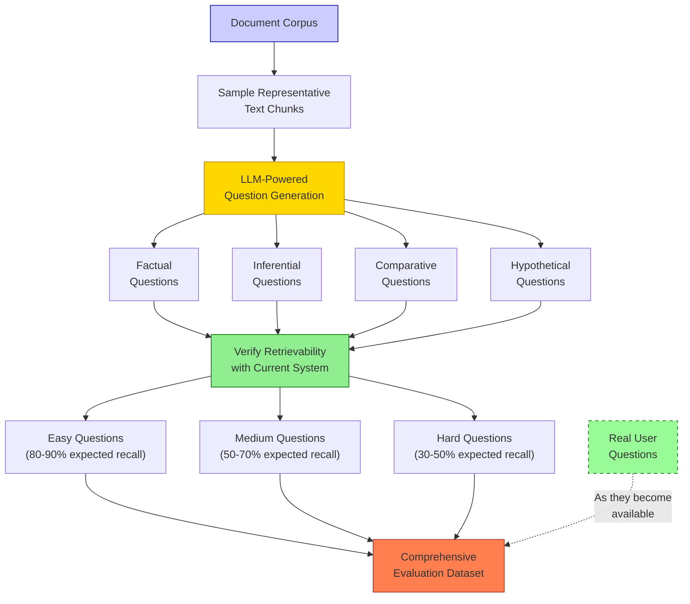

# Kickstarting the Data Flywheel with Synthetic Data

### Key Insight

**You can't improve what you can't measure—and you can measure before you have users.** Synthetic data isn't just a stopgap until real users arrive. It's a powerful tool for establishing baselines, testing edge cases, and building the evaluation infrastructure that will power continuous improvement. Start with retrieval metrics (precision and recall), not generation quality, because they're faster, cheaper, and more objective.

Most teams get stuck in an unproductive loop of random tweaks without clear measurement. This chapter addresses that by covering evaluation setup, common pitfalls to avoid, and how to use synthetic data to test systems before deployment.

## Learning Objectives

By the end of this chapter, you will be able to:

1. **Understand common pitfalls that sabotage RAG applications** - Identify and avoid the reasoning fallacy, vague metrics problem, and generic solution trap that prevent meaningful improvement
2. **Distinguish between leading and lagging metrics** - Focus on actionable leading metrics like experiment velocity rather than outcome metrics you cannot directly control
3. **Combat absence blindness and intervention bias** - Systematically address what you cannot see and avoid making changes without measuring impact
4. **Build comprehensive evaluation frameworks using synthetic data** - Create evaluation datasets before having real users to establish baselines and test improvements
5. **Implement retrieval-focused metrics first** - Prioritize precision and recall over generation quality because they are faster, cheaper, and more objective to measure
6. **Create systematic experimentation processes** - Establish the data flywheel that turns evaluation examples into training data for continuous improvement

These objectives establish the foundational measurement and improvement practices that enable all advanced techniques in subsequent chapters.

## Common Pitfalls in AI Development

Recurring patterns emerge across organizations of all sizes. Teams frequently hire ML engineers without establishing data collection infrastructure, then wait months to gather the information needed for improvement. Understanding these patterns helps avoid costly mistakes.

### The Reasoning Fallacy

"We need more complex reasoning" or "the model isn't smart enough" are common refrains. In most cases, that's not the actual problem. The real issue is insufficient understanding of user needs.

Critical questions often go unasked:

- What does data from actual usage reveal?
- What patterns emerge from user feedback beyond positive reviews?
- What specific problems are users trying to solve?

Without answers, teams build generic tools that don't solve any specific problem particularly well.

### The Vague Metrics Problem

Teams spend weeks making changes, then evaluate success through subjective assessment: "does it look better?" or "does it feel right?"

Organizations with substantial resources sometimes operate with fewer than 30 evaluation examples total. When performance shifts—either degradation or improvement—they cannot identify what changed or why.

Without concrete metrics, you get stuck in this loop:

1. Make random changes based on gut feeling
2. Get unclear results
3. Feel frustrated
4. Make more random changes

And round and round you go.



### Building Generic Solutions

This pitfall often stems from good intentions—building something that helps everyone. The result is typically a generic tool that does everything poorly instead of one thing well.

Teams with high churn rates sometimes hesitate to narrow their focus, worried about missing hypothetical use cases.

The more effective path: establish excellence in a narrow domain, then expand. Deep learning from 100 satisfied users in one domain beats shallow insights from 1,000 frustrated users across ten domains.

### The Complexity Trap

Over 90% of complexity additions to RAG systems perform worse than simpler approaches when properly evaluated. Teams implement sophisticated multi-stage retrieval pipelines, complex re-ranking systems, and elaborate preprocessing without first establishing whether these additions actually improve performance.

The pattern is predictable:

1. System has performance issues
2. Team adds complexity without measurement
3. Performance gets worse (or stays the same)
4. Team adds more complexity to "fix" the first addition
5. System becomes unmaintainable

The solution: implement evaluations before increasing complexity. Establish baselines, make one change, measure the impact. If a sophisticated approach doesn't measurably outperform a simple one, use the simple one.

### Silent Data Loss

Data quality issues often fail silently, degrading system performance without obvious errors. Common causes include:

**Encoding failures**: In one medical chatbot project, 21% of documents were silently dropped because the system assumed UTF-8 encoding when many files used Latin-1. The index shrunk by a fifth without any error messages.

**Extraction failures**: PDF parsing, especially for tables and complex layouts, frequently produces malformed output. If extraction validation isn't implemented, corrupted chunks enter the index.

**Pipeline drops**: Documents can be lost at any stage—collection, processing, chunking, embedding, indexing—if failures aren't explicitly monitored and logged.

**Prevention strategies:**

- Track document counts at every pipeline stage
- Monitor for sudden drops in index size
- Validate extracted content meets minimum quality thresholds
- Log failures explicitly rather than silently skipping problematic documents
- Implement encoding detection rather than assuming formats

Silent failures are particularly dangerous because they erode system quality gradually, making it difficult to identify when and why performance degraded.

## Leading versus Lagging Metrics

This distinction fundamentally changes how to approach system improvement.

### Lagging Metrics

Lagging metrics are the things you care about but can't directly control:

- Application quality
- User satisfaction
- Churn rates
- Revenue

They're like your body weight - easy to measure, hard to change directly.

### Leading Metrics

Leading metrics are things you can control that predict future performance:

- Number of experiments run per week
- Evaluation coverage of different question types
- Retrieval precision and recall
- User feedback collection rate

They're like calories consumed or workouts completed - you have direct control.

### The Calories In, Calories Out Analogy

A simple analogy clarifies this distinction. Weight loss is a lagging metric—obsessing over the scale doesn't help much. What works? Tracking calories in and calories out (leading metrics).

It's not perfect, but it's actionable. You can't directly control your weight today, but you can control whether you eat 2,000 or 3,000 calories.

RAG applications work the same way. You can't directly make users happy, but you can run more experiments, improve retrieval metrics, and collect more feedback.

### The #1 Leading Metric: Experiment Velocity

For early-stage RAG applications, the most actionable metric is experiment frequency: how many experiments are you running?

Instead of asking "did the last change improve things?" ask "how can we run twice as many experiments next week?" What infrastructure would enable this? What blocks rapid testing?

Teams that focus on experiment velocity often see 6-10% improvements in recall with hundreds of dollars in API calls—work that previously required tens of thousands in data labeling costs.

This shift from outcome obsession to velocity focus changes everything. It emphasizes the infrastructure and processes that enable learning rather than fixating on results you cannot directly control.

## Production Monitoring: Tracking What Matters

While synthetic evaluation gets you started, production monitoring tells you what's happening with real users. The key is tracking changes in metrics over time rather than obsessing over absolute values.

### Monitoring Cosine Distance Changes

Track the average cosine distance of your queries over time. Sudden changes indicate shifts in your data or user behavior, not necessarily problems with your system.

A practical example: In a product recommendation system, average cosine distance dropped suddenly. By segmenting the data by signup date, gender, and life stage, the team discovered they had onboarded many young users through a Super Bowl ad campaign who couldn't afford the $300 clothing items. The system was working fine—the user base had shifted.

**What to monitor:**

- Average cosine distance per query
- Re-ranker score distributions
- Changes across user segments (signup cohort, geography, use case)
- Trends over time rather than absolute values

**When to investigate:**

- Sudden drops or spikes in average metrics
- Divergence between user segments
- Gradual drift over weeks/months

### The Trellis Framework for Production Monitoring

The Trellis framework (Targeted Refinement of Emergent LLM Intelligence through Structured Segmentation) provides a structured approach for organizing production improvements. Developed at Oleve for products reaching millions of users within weeks, it has three core principles:

1. **Discretization**: Convert infinite output possibilities into specific, mutually exclusive buckets (e.g., "math homework help" vs "history assignment assistance")

2. **Prioritization**: Score buckets based on Volume × Negative Sentiment × Achievable Delta × Strategic Relevance

3. **Recursive refinement**: Continuously organize within buckets to find more structure

The framework helps identify which improvements matter most. Rather than optimizing based solely on volume (which often means improving what you're already good at), it directs attention to high-impact problems that are solvable and strategically important.

### Implicit and Explicit Signals

Production monitoring requires tracking both types of signals:

**Implicit signals** from the data itself:

- User frustration patterns ("Wait, no, you should be able to do that")
- Task failures (model says it can't do something)
- Model laziness (incomplete responses)
- Context loss (forgetting previous interactions)

**Explicit signals** from user actions:

- Thumbs up/down ratings
- Regeneration requests (first response inadequate)
- Search abandonment
- Code errors (for coding assistants)
- Content copying or sharing (positive signals)

For applications with fewer than 500 daily events, pipe every user interaction into a Slack channel for manual review. This helps discover not just model errors but product confusion and missing features users expect.

**Key insight:** Traditional error monitoring tools like Sentry don't work for AI products because there's no explicit error when an AI system fails—the model simply produces an inadequate response. You need specialized approaches to identify problematic patterns in outputs and user interactions.

## Absence Blindness and Intervention Bias

These two biases kill more RAG projects than anything else.

### Absence Blindness

You can't fix what you can't see. Teams often obsess over generation quality while completely ignoring whether retrieval works at all.

A common pattern: teams spend weeks fine-tuning prompts, only to discover their retrieval system returns completely irrelevant documents. No amount of prompt engineering can fix that fundamental problem.

Critical questions often overlooked:

- Is retrieval actually finding the right documents?
- Are our chunks the right size?
- Is our data extraction pipeline working?
- Do we have separate metrics for retrieval vs generation?

### Intervention Bias

This is the tendency to do _something_ just to feel like progress is being made. In RAG, it manifests as constantly switching models, tweaking prompts, or adding features without measuring impact.

Common questions that reveal this bias:

- "Should we use GPT-4 or Claude?"
- "Will this new prompt technique help?"

The answer always depends on your data and evaluations. There's no universal best choice.

The solution: every change should target a specific metric and test a clear hypothesis. Eliminate exploratory changes without measurement.

## Error Analysis: The Foundation of Effective Evaluation

Before building automated evaluators, manually review system outputs to identify genuine failure modes. This step is often skipped in favor of immediately building metrics, but it's the most critical practice for effective evaluation. The methodology outlined here draws from practices documented in [Hamel Husain's LLM Evals FAQ](https://hamel.dev/blog/posts/evals-faq/).

### The Open Coding to Axial Coding Process

Start with **open coding**: review 100+ system outputs and take detailed notes on what's failing. Don't categorize yet—just observe and document specific problems as they occur.

Then move to **axial coding**: group your observations into patterns and categories. These categories become the foundation for your automated evaluations.

This process requires a domain expert or "benevolent dictator"—someone with tacit knowledge of user expectations and domain nuances that external annotators cannot replicate. Error analysis helps you decide what evals to write in the first place.

### Binary Over Complex Scoring

Prefer simple binary evaluations (pass/fail) over 1-5 rating scales. Binary decisions:

- Force clarity about what constitutes success
- Improve consistency across annotators
- Process faster during analysis
- Eliminate false precision from subjective differences between adjacent scale points

Likert scales create the illusion of granularity while introducing more noise from subjective interpretation.

### Custom Over Generic Metrics

Generic "ready-to-use" metrics like helpfulness, coherence, or quality scores waste time and create false confidence. Build domain-specific evaluators based on real failure patterns you discover through error analysis, not imagined problems.

Many issues identified through error analysis are quick fixes—obvious bugs or simple prompt adjustments. Reserve expensive LLM-as-judge evaluators for persistent problems you'll iterate on repeatedly.

## The RAG Flywheel and Retrieval Evaluations

Everything learned about information retrieval and search applies to RAG retrieval. If you have a basic RAG setup, the next step is testing whether retrieval actually works.

### Why Prioritize Retrieval Evaluations

Teams often jump straight to generation evaluations. Start with retrieval evaluations instead for several reasons:

1. **Speed**: Milliseconds vs seconds per evaluation
2. **Cost**: Orders of magnitude cheaper to run
3. **Objectivity**: Binary yes/no answers rather than subjective quality assessments
4. **Scalability**: Run thousands of tests quickly

Focusing on generation quality too early makes everything subjective. Did the model hallucinate? Is this answer good enough? These questions lack clear answers without proper baselines.

Retrieval evaluation is straightforward: did you find the right document or not? This objective foundation enables rapid iteration before tackling the more complex generation quality question.

## Understanding Precision and Recall

Concrete definitions:

**Testing Different K Values:**

- Start with K=10
- Test K=3, 5, 10, 20 to understand tradeoffs
- Higher K improves recall but may hurt precision
- Advanced models (GPT-4, Claude, Sonnet) handle irrelevant docs better, so lean toward higher K

**Model Evolution and Precision Sensitivity:**

Modern language models have been specifically optimized for high-recall scenarios (the "needle in haystack" problem). This means they're quite good at ignoring irrelevant information when it's mixed with relevant content. Older models like GPT-3.5 were more sensitive to low precision—they would "overthink" or get confused when presented with too many irrelevant documents.

This evolution has practical implications:

- With modern models: prioritize recall, accept some precision loss
- With older or smaller models: maintain higher precision to avoid confusion
- Always test your specific model with different precision-recall trade-offs

**Why Score Thresholds Are Dangerous:**

- Score distributions vary wildly by query type
- A threshold that works for one category fails for others
- Example: average ada-002 score is 0.7, but 0.5 for ada-003
- Better approach: Always return top K, let the LLM filter
- **Warning**: Re-ranker scores aren't true probabilities—don't treat a 0.5 threshold as "50% confidence"

When setting thresholds, base them on diminishing recall returns rather than absolute score values. Test with your specific data to find where additional results stop adding value.



**Recall**: What percentage of relevant documents did you find? If there are 10 correct documents and you found 4, that's 40% recall.

**Precision**: What percentage of your results were actually relevant? If you returned 10 results but only 2 were relevant, that's 20% precision.

With modern LLMs, prioritize recall. They handle irrelevant context well. With simpler models, precision matters more due to increased susceptibility to noise.

## Case Studies: Real-World Improvements

Two examples demonstrate how focusing on retrieval metrics leads to rapid improvements.

### Case Study 1: Report Generation from Expert Interviews

A consulting firm generates reports from user research interviews. Consultants conduct 15-30 interviews per project and need AI-generated summaries that capture all relevant insights.

**Problem**: Reports were missing critical quotes. A consultant knew 6 experts said something similar, but the report only cited 3. That 50% recall rate destroyed trust. Consultants started spending hours manually verifying reports, defeating the automation's purpose.

**Investigation**: Built manual evaluation sets from problematic examples. The issues turned out to be surprisingly straightforward—text chunking was breaking mid-quote and splitting speaker attributions from their statements.

**Solution**: Redesigned chunking to respect interview structure. Kept questions and answers together. Preserved speaker attributions with their complete statements. Added overlap between chunks to catch context that spanned sections.

**Result**: Recall improved from 50% to 90% in three iterations—a 40 percentage point improvement that customers noticed immediately. More importantly, consultants stopped manually verifying every report. Trust was restored, and the tool delivered its promised value. This measurable improvement enabled continued partnership and expansion to other use cases.

### Case Study 2: Blueprint Search for Construction

A construction technology company needed AI search for building blueprints. Workers asked questions like "Which rooms have north-facing windows?" or "Show me all electrical outlet locations in the second-floor bedrooms."

**Problem**: Only 27% recall when finding the right blueprint sections for questions. Workers would ask simple spatial questions and get completely unrelated blueprint segments. The system was essentially useless—workers abandoned it and went back to manually scrolling through PDFs.

**Investigation**: Standard text embeddings couldn't handle the spatial and visual nature of blueprint queries. "North-facing windows" and "electrical outlets" are visual concepts that don't translate well to text chunks.

**Solution**: Used a vision model to create detailed textual captions for blueprints. Each caption included:

- Room identification and purpose
- Spatial relationships (north side, adjacent to, etc.)
- Visible features (windows, doors, outlets, fixtures)
- Hypothetical questions users might ask about that section

**Result**: Four days later, recall jumped from 27% to 85%—a 58 percentage point improvement. Workers started actually using the system. Once live, usage data revealed that 20% of queries involved counting objects ("How many outlets in this room?"). This justified investing in bounding box detection models for those specific counting use cases, further improving accuracy to 92% for counting queries.

**Key Lesson**: Test subsystems independently for rapid improvements. Don't try to solve everything at once. The vision-to-text transformation solved 80% of the problem in days. The specialized counting feature solved the remaining 20% over the following weeks. Synthetic data generation—creating hypothetical questions for each blueprint—proved invaluable for training and evaluation.

**Chunk Size Best Practices:**

Start with 800 tokens and 50% overlap. This works for most use cases.

Why chunk optimization rarely gives big wins:

- Usually yields <10% improvements
- Better to focus on:
  - Query understanding and expansion
  - Metadata filtering
  - Contextual retrieval (adding document context to chunks)
  - Better embedding models

When to adjust:

- Legal/regulatory: Larger chunks (1500-2000 tokens) to preserve full clauses
- Technical docs: Smaller chunks (400-600 tokens) for precise retrieval
- Conversational: Page-level chunks to maintain context

## Practical Implementation: Building Your Evaluation Framework

Time to build something that actually works. Your framework should:

1. Run questions through retrieval
2. Compare results to ground truth
3. Calculate precision and recall
4. Track changes over time

This becomes your improvement flywheel. Every change gets evaluated against these metrics.

### Building a Practical Evaluation Pipeline

A simple but effective evaluation pipeline:

```python
def evaluate_retrieval(evaluation_data, retriever_fn, k=10):
    """
    Evaluate retrieval performance on a dataset.

    Args:
        evaluation_data: List of dicts with 'question' and 'relevant_docs' keys
        retriever_fn: Function that takes question text and returns docs
        k: Number of top results to consider

    Returns:
        Dict containing evaluation metrics
    """
    results = []

    for item in evaluation_data:
        question = item['question']
        ground_truth = set(item['relevant_docs'])

        # Call retrieval system
        retrieved_docs = retriever_fn(question, top_k=k)
        retrieved_ids = [doc['id'] for doc in retrieved_docs]

        # Calculate metrics
        retrieved_relevant = set(retrieved_ids) & ground_truth
        precision = len(retrieved_relevant) / len(retrieved_ids) if retrieved_ids else 0
        recall = len(retrieved_relevant) / len(ground_truth) if ground_truth else 1.0

        # Store individual result
        results.append({
            'question_id': item.get('id', ''),
            'question': question,
            'precision': precision,
            'recall': recall,
            'retrieved_docs': retrieved_ids,
            'relevant_docs': list(ground_truth),
            'metadata': item.get('metadata', {})
        })

    # Aggregate metrics
    avg_precision = sum(r['precision'] for r in results) / len(results)
    avg_recall = sum(r['recall'] for r in results) / len(results)

    return {
        'avg_precision': avg_precision,
        'avg_recall': avg_recall,
        'detailed_results': results
    }
```

### Running Regular Evaluations

Make evaluation part of your routine:

1. **Continuous testing**: Run with every significant change
2. **Weekly benchmarks**: Comprehensive evaluations on schedule
3. **Version comparison**: Always compare new vs old
4. **Failure analysis**: Review 0% recall cases for patterns
5. **Difficulty progression**: Add harder tests as you improve

### Production Monitoring: Beyond Traditional Error Tracking

Traditional error monitoring (like Sentry) doesn't work for AI systems—there's no exception when the model just produces bad output. RAG systems require a fundamentally different monitoring approach.

**Critical Insight**: Track _changes_ in metrics, not absolute values. The absolute cosine distance between queries and documents matters less than whether that distance is shifting over time. A sudden change in average cosine distance often signals a meaningful shift in user behavior or system performance.

**Two Categories of Signals to Monitor:**

1. **Explicit Signals**:
   - Thumbs up/down feedback
   - Regeneration requests
   - User-provided corrections
   - Citations copied or deleted

2. **Implicit Signals**:
   - User frustration patterns (rapid query reformulations)
   - Task abandonment vs completion
   - Dwell time on results
   - Navigation patterns after receiving results

**Segment Analysis Methodology:**

Don't just track aggregate metrics. Segment by:

- User cohorts and signup dates
- Demographics or user types
- Query categories or topics
- Time periods (weekday vs weekend, seasonal patterns)

When metrics shift, segment analysis helps identify root causes. Example: A company's cosine distances spiked during their Super Bowl ad. Rather than treating this as a system failure, segmentation revealed a new user cohort asking fundamentally different questions. This led to targeted onboarding content and 25% retention improvement.

**The Trellis Framework for Managing Infinite Outputs:**

AI systems produce infinite possible outputs, making traditional monitoring approaches insufficient. The Trellis framework provides structure:

1. **Discretization**: Organize infinite outputs into controllable segments
2. **Prioritization**: Rank segments using: Volume × Negative Sentiment × Achievable Delta × Strategic Relevance
3. **Recursive Refinement**: Continuously improve highest-priority segments

**Practical Monitoring Metrics:**

- **Cosine distance trends**: Average similarity between queries and retrieved documents over time
- **Re-ranker score distributions**: Track for drift; watch for bimodal patterns indicating two distinct query types
- **Zero-result rate**: Percentage of queries finding no documents above threshold
- **Retrieval latency P50, P95, P99**: Performance degradation often indicates index issues

**For Small-Scale Systems (<500 daily events):**

Pipe every interaction to Slack for manual review. This "extreme visibility" approach catches issues faster than automated monitoring during early stages and builds team intuition about failure modes.

### Integrating with Development Workflow

To maximize value:

1. **Build a dashboard**: Simple interface showing trends
2. **Automate testing**: Part of CI/CD
3. **Set alerts**: Notify when metrics drop
4. **Document experiments**: Track changes and impact
5. **Connect to business**: Link retrieval metrics to outcomes

Your framework should evolve with your application. Start simple, add complexity as needed.

## Vector Database Selection Guide

Vector database selection is a common question. Guidance based on production deployments:

### Understanding Your Requirements

First, figure out:

1. **Scale**: How many documents/chunks?
2. **Query patterns**: Need metadata filtering? SQL? Hybrid search?
3. **Performance**: Latency requirements?
4. **Infrastructure**: Existing database expertise?
5. **Budget**: Open source vs managed?

### Vector Database Comparison

| Database                     | Best For                        | Pros                                                                                                      | Cons                                                                                                                  | When to Use                                                                                |
| ---------------------------- | ------------------------------- | --------------------------------------------------------------------------------------------------------- | --------------------------------------------------------------------------------------------------------------------- | ------------------------------------------------------------------------------------------ |
| **PostgreSQL + pgvector**    | Teams with SQL expertise        | • Familiar SQL interface<br>• Metadata filtering<br>• ACID compliance<br>• Single database for everything | • Not optimized for vector operations<br>• Limited to ~1M vectors for good performance<br>• No built-in hybrid search | When you need to combine vector search with complex SQL queries and already use PostgreSQL |
| **LanceDB**                  | Experimentation & hybrid search | • One-line hybrid search<br>• Built-in re-ranking<br>• S3 storage support<br>• DuckDB for analytics       | • Newer, less battle-tested<br>• Smaller community                                                                    | When you want to quickly test lexical vs vector vs hybrid search approaches                |
| **Timescale pgvector_scale** | Large-scale exhaustive search   | • Exhaustive search capability<br>• Better scaling than pgvector<br>• Time-series support                 | • Requires Timescale<br>• More complex setup                                                                          | When you need guaranteed recall on large datasets with time-based queries                  |
| **ChromaDB**                 | Simple prototypes               | • Easy to get started<br>• Good Python API<br>• Local development friendly                                | • Performance issues at scale<br>• Limited production features                                                        | For POCs and demos under 100k documents                                                    |
| **Turbopuffer**              | High-performance search         | • Very fast<br>• Good scaling<br>• Simple API                                                             | • Newer entrant<br>• Limited ecosystem                                                                                | When raw performance is critical                                                           |
| **Pinecone**                 | Managed solution                | • Fully managed<br>• Good performance<br>• Reliable                                                       | • Expensive at scale<br>• Vendor lock-in                                                                              | When you want zero infrastructure management                                               |

### Decision Framework



### Implementation Example: LanceDB for Hybrid Search

We use LanceDB in this course because it makes comparing retrieval strategies trivial:

```python
import lancedb
from lancedb.embeddings import get_registry
from lancedb.pydantic import LanceModel, Vector
from lancedb.rerankers import CohereReranker

# Define your schema
class Document(LanceModel):
    text: str
    source: str
    metadata: dict
    vector: Vector(get_registry().get("openai").create())

# Create database
db = lancedb.connect("./my_rag_db")
table = db.create_table("documents", schema=Document)

# Add documents
table.add([
    Document(text="...", source="...", metadata={...})
    for doc in documents
])

# Compare retrieval strategies with one line changes
results_vector = table.search(query).limit(10).to_list()
results_lexical = table.search(query, query_type="fts").limit(10).to_list()
results_hybrid = table.search(query, query_type="hybrid").limit(10).to_list()

# Add re-ranking with one more line
reranker = CohereReranker()
results_reranked = table.search(query).limit(50).rerank(reranker).limit(10).to_list()
```

This flexibility lets you quickly test what works for your data without rewriting everything.

### Migration Considerations

If you're already using a vector database but having issues:

1. **Measure first**: Quantify current performance
2. **Test in parallel**: Run subset of queries against both
3. **Compare results**: Use evaluation metrics to ensure quality
4. **Plan migration**: Consider dual-writing during transition

Don't choose based on hype or benchmarks. Choose based on your team's expertise, query patterns, scaling needs, and budget.

From office hours: "We generally want to use SQL databases. If you use something like Timescale or PostgreSQL, there are many ways of doing time filtering... The general idea is to use structured extraction to identify start and end dates, prompt your language model with an understanding of what those dates are, and then use filtering."

## Creating Synthetic Data for Evaluation

No user data yet? No problem. Synthetic data gets you started. But it's not as simple as asking an LLM for "more data" - you need diverse, realistic datasets that reflect real usage.



### Basic Approach: Question Generation

Simple version:

1. Take random text chunk
2. Ask LLM to generate a question this chunk answers
3. Verify retrieval finds the original chunk

This creates a basic dataset testing whether your system finds the right info. Recall becomes binary: found it or didn't.

### Generating Diverse Synthetic Data

For truly valuable synthetic data, you need variety:

#### 1. Variation in Question Types

Test different retrieval capabilities:

- **Factual**: Direct questions with explicit answers
- **Inferential**: Connecting multiple pieces of info
- **Comparative**: Comparing entities or concepts
- **Hypothetical**: "What if" scenarios
- **Clarification**: Asking for elaboration

#### 2. Linguistic Diversity Techniques

Vary phrasing:

- **Paraphrasing**: Multiple ways to ask the same thing
- **Terminology**: Synonyms and domain language
- **Complexity**: Mix simple and compound queries
- **Length**: Short keywords to verbose questions
- **Format**: Questions, commands, implied questions

#### 3. Chain-of-Thought Generation

Use CoT for nuanced questions:

```
Given this text chunk:
[CHUNK]

First, identify 3-5 key facts or concepts in this text.
For each key concept:
1. Think about different ways someone might ask about it
2. Consider various levels of prior knowledge the asker might have
3. Imagine different contexts in which this information might be relevant

Now, generate 5 diverse questions about this text that:
- Vary in complexity and format
- Would be asked by users with different backgrounds
- Target different aspects of the information
- Require different types of retrieval capabilities to answer correctly

For each question, explain your reasoning about why this is a realistic user question.
```

#### 4. Few-Shot Prompting for Domain Specificity

If you have real user questions, use them:

```
I'm creating questions that users might ask about [DOMAIN].
Here are some examples of real questions:

1. [REAL QUESTION 1]
2. [REAL QUESTION 2]
3. [REAL QUESTION 3]

Here's a text passage:
[CHUNK]

Please generate 5 new questions similar in style and intent to the examples above,
that would be answered by this text passage.
```

#### 5. Adversarial Question Generation

Create deliberately challenging questions:

```
Given this text passage:
[CHUNK]

Generate 3 challenging questions that:
1. Use different terminology than what appears in the passage
2. Require understanding the implications of the content
3. Might confuse a basic keyword search system
4. Would still be reasonable questions a user might ask

For each question, explain why it's challenging and what makes it a good test case.
```

### Building Comprehensive Evaluation Sets

Structure your evaluation sets strategically:

1. **Coverage mapping**: Cover all document types and topics
2. **Difficulty distribution**: Easy (80-90% expected recall), medium (50-70%), hard (30-50%)
3. **Ground truth validation**: Have experts verify questions and docs
4. **Domain segmentation**: Separate sets for different use cases
5. **Synthetic/real blending**: Gradually mix in real data as you get it

### Using Synthetic Data Beyond Evaluation

Your synthetic data can do more:

1. **Retrieval benchmarking**: Measuring search quality
2. **Few-shot examples**: Enhancing LLM understanding
3. **Fine-tuning data**: Training specialized embeddings/rerankers
4. **User experience testing**: Simulating realistic sessions

Good synthetic data upfront accelerates everything else.

**Model Sensitivity Warning:**

Models are more sensitive to irrelevant info than you'd expect. Even GPT-4 and Claude get distracted by marginally relevant content.

This matters for:

- Multi-step reasoning
- Numerical calculations
- Finding specific facts in specific documents

Test by:

1. Creating test cases with varying irrelevant info
2. Measuring performance degradation
3. Using results to set precision/recall tradeoffs

Example: One team found 5 irrelevant documents (even marked as "potentially less relevant") reduced financial calculation accuracy by 30%. They adjusted retrieval to favor precision for numerical queries.

## Additional Resources

**Tools and Libraries for RAG Evaluation:**

- **[RAGAS](https://github.com/explodinggradients/ragas)**: Open-source framework for evaluating RAG applications
- **[LangChain Evaluation](https://python.langchain.com/docs/guides/evaluation/)**: Tools for evaluating retrieval and generation
- **[Prompttools](https://github.com/promptslab/prompttools)**: Toolkit for testing and evaluating LLM applications
- **[MLflow for Experiment Tracking](https://mlflow.org/)**: Open-source platform for managing ML lifecycle

## This Week's Action Items

Based on the content covered, here are your specific tasks:

### Immediate Actions (Start This Week)

1. **Audit Current State**
   - Count your existing evaluations (aim for 20+ minimum)
   - Identify your leading vs lagging metrics
   - Document your current experiment velocity (how many tests per week?)

2. **Create Your First Evaluation Set**
   - Build 10-20 query/expected-chunk pairs for your most common use cases
   - Test current retrieval performance to establish baseline
   - Include easy, medium, and hard difficulty levels

3. **Run Your First Experiment**
   - Change one variable (chunk size, embedding model, K value)
   - Measure before and after performance with concrete metrics
   - Document what you learned and plan next experiment

### Technical Implementation

4. **Build Evaluation Pipeline**
   - Implement the basic retrieval evaluation function from this chapter
   - Set up automated testing that runs with each significant change
   - Create a simple dashboard or tracking system for metrics

5. **Generate Synthetic Data**
   - Use the prompt templates provided to create diverse questions
   - Test different query types: factual, inferential, comparative
   - Validate that your system can retrieve the expected chunks

6. **Experiment with Retrieval Settings**
   - Test different K values (3, 5, 10, 20) and measure precision/recall tradeoffs
   - Try hybrid search if using LanceDB or similar systems
   - Compare different embedding models or reranking approaches

### Strategic Planning

7. **Focus on Leading Metrics**
   - Track experiment velocity as your primary success measure
   - Plan infrastructure investments that increase experiment speed
   - Shift standup discussions from outcomes to experiment planning

8. **Combat Biases**
   - Check retrieval quality before focusing on generation
   - Make specific, hypothesis-driven changes rather than random tweaks
   - Build systems to capture what you can't currently see

## Reflection Questions

Take a minute to think about:

1. What are your leading and lagging metrics? How do they connect?
2. How could you generate more diverse and challenging synthetic questions for your domain?
3. Where does your current evaluation framework fall short? What metrics would help?
4. What experiment could you run this week to test an improvement hypothesis?
5. How will you incorporate real user feedback as it comes in?

## Conclusion and Next Steps

We've covered the foundation for systematic RAG improvement through proper evaluation. No more subjective judgments or random changes - you now have tools to measure progress objectively and make data-driven decisions.

By focusing on retrieval metrics like precision and recall, you can run more experiments faster, cheaper, and with more confidence. This sets you up for incorporating user feedback and advanced techniques.

In [Chapter 2](chapter2.md), we'll explore converting evaluations into training data for fine-tuning, creating specialized models for your specific needs.

## Summary

Key principles to remember:

1. **Focus on leading metrics** - Especially experiment velocity, which you control
2. **Do the obvious thing repeatedly** - Success looks boring, like counting calories
3. **Combat absence blindness** - Check retrieval quality, not just generation
4. **Avoid intervention bias** - Make targeted changes based on hypotheses
5. **Embrace empiricism** - No universal answers, test everything

The goal isn't chasing the latest AI techniques. It's building a flywheel of continuous improvement driven by clear metrics aligned with user outcomes. Start with synthetic data, focus on retrieval before generation, and measure everything.

As one client told me: "We spent three months trying to improve through prompt engineering and model switching. In two weeks with proper evaluations, we made more progress than all that time combined."

---
